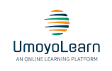

# UmoyoLearn: An Online Learning Platform



UmoyoLearn is an online learning platform that empowers users to explore a world of knowledge at their fingertips. Whether you're a student, educator, or lifelong learner, UmoyoLearn offers a wide range of courses and resources to enhance your skills and broaden your horizons.

## Features

- **User Registration**: Create an account and join our learning community.
- **Course Listings**: Browse through a diverse selection of courses on various topics.
- **User Dashboard**: Track your course progress, achievements, and certificates.
- **Interactive Learning**: Engage with course materials, quizzes, and discussions.
- **Real-time Updates**: Get instant notifications and updates on your courses.
- **Responsive Design**: Access UmoyoLearn on any device, from desktop to mobile.

## Technologies Used

- **Frontend**: ReactJS
- **Backend**: NodeJS with GraphQL
- **Database**: PostgreSQL
- **Authentication**: JSON Web Tokens (JWT)
- **Styling**: [CSS Framework or Libraries]
- **Deployment**: AWS

## Getting Started

To run UmoyoLearn locally on your machine, follow these steps:

1. Clone this repository:
   ```bash
   git clone https://github.com/chibwesamuel/umoyo-learn-frontend.git

    Navigate to the project directory:

    bash

cd umoyo-learn-frontend

Install dependencies:

bash

npm install

Start the development server:

bash

    npm start

    Open your web browser and visit http://localhost:3000 to access UmoyoLearn.

Contributing

We welcome contributions from the open-source community. If you'd like to contribute to UmoyoLearn, please follow our contribution guidelines.
Contact

For any questions, feedback, or support, please reach out to our team at your-email@example.com.
License

This project is licensed under the MIT License.
